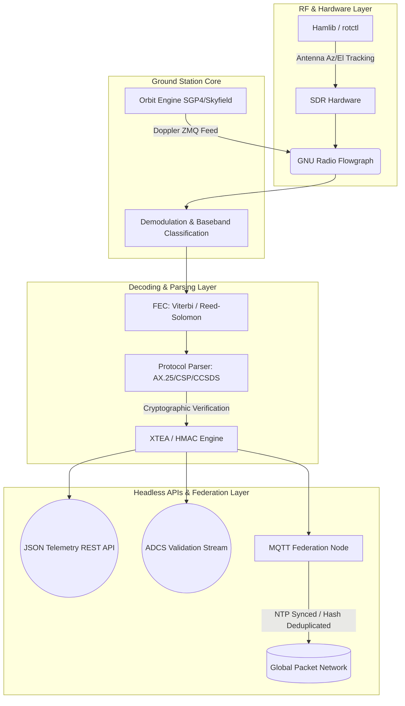

<div align="center">

# CubeSat Telemetry Decoder

**Aerospace-Grade Headless Ground Station Framework**

[](https://python.org)
[]()
[]()
[](https://github.com/DynamiX-Labs)

*A high-performance, API-first pipeline for receiving, tracking, and parsing telemetry beacons from amateur and university CubeSats. Designed for distributed ground station networks.*

</div>

---

## Architecture Overview

`CubeSat-Telemetry-Decoder` is a headless, professional-grade telemetry decoding framework. Moving beyond basic scripting, it provides a comprehensive digital signal processing (DSP) and network parsing pipeline. It integrates directly with Software Defined Radio (SDR) hardware, dynamically tracks orbital bodies, corrects Doppler shifts in real-time via ZeroMQ, applies Forward Error Correction (FEC), and parses complex space protocols.

Designed with an API-first architecture, it outputs clean JSON telemetry streams and validation endpoints, allowing engineers to build custom dashboards, Digital Twins, or integrate into larger mission control systems.

### Core Architecture Pipeline



---

## Visual Documentation & System Outputs

The framework integrates deeply with RF analysis tools. Below are examples of the pipeline stages from raw RF ingestion to packet decoding.

### RF Ingestion and Signal Processing

The system captures wideband spectrum data and isolates the narrow carrier signals. The GNU Radio layer handles initial baseband filtering and carrier recovery.

<div align="center">
  
  <br><i>Figure 1: Wideband SDR waterfall display capturing a LEO satellite pass.</i>
</div>

<br>

<div align="center">
  
  <br><i>Figure 2: Baseband spectrum peak isolation prior to demodulation.</i>
</div>

### GNU Radio Integration & Packet Inspection

The ZMQ bridge allows for dynamic control of the GNU Radio flowgraph, updating variables such as center frequency based on the SGP4 Doppler calculations. Once demodulated and deframed, packets are passed to the parser for bit-level extraction.

<div align="center">
  
  <br><i>Figure 3: Core GNU Radio Companion flowgraph for QPSK/BPSK demodulation.</i>
</div>

<br>

<div align="center">
  
  <br><i>Figure 4: Bit-level inspection and hexadecimal output of parsed AX.25 frames.</i>
</div>

---

## Advanced Capabilities

This framework is built to handle the theoretical and practical realities of high-noise, high-Doppler space communications:

*   **Real-Time Doppler & Rig Control**: Uses `sgp4` and `skyfield` for live TLE propagation. Feeds sub-Hertz frequency corrections to GNU Radio via ZMQ, smoothed by an Exponential Moving Average (EMA) closed-loop filter to prevent tuning oscillation.
*   **Robust Signal Recovery**: Incorporates complex Forward Error Correction (FEC) layers (Viterbi and Reed-Solomon) with precise Sync Word detection and frame alignment for bit-slip correction.
*   **Cryptographic Security**: Implements strict XTEA decryption algorithms and HMAC verification for the CubeSat Space Protocol (CSP), followed by a semantic validation layer to reject structurally valid but physically impossible decrypted payloads.
*   **Federation PKI Architecture**: Facilitates the sharing and aggregation of decoded packets globally via MQTT. It enforces strict chronyc-based timestamping and utilizes a full asymmetric Public Key Infrastructure (ECDSA SECP256R1) to digitally sign and verify every telemetry packet, guaranteeing aerospace-grade trust.
*   **Headless Interfaces & Auto-Calibration**: Exposes raw telemetry vectors and ADCS validation streams. Includes an automated Signal Classifier with confidence scoring, and an Anomaly Detector that utilizes a strict learning mode to establish Z-score baselines.

---

## Supported Hardware & Protocols

| Category | Supported Technologies |
| :--- | :--- |
| **SDR Hardware** | RTL-SDR, HackRF, PlutoSDR, USRP, **LimeSDR**, **Airspy** |
| **Modulations** | AFSK, BPSK, **QPSK/8PSK**, **GMSK**, **LoRa** |
| **Protocols** | AX.25 (UI Frames), CCSDS (Space Packet), CSP (GomSpace), Custom RAW |
| **Error Correction** | Reed-Solomon (CCSDS Standard), Viterbi (r=1/2, K=7) |

---

## Quick Start Guide

```bash
git clone https://github.com/DynamiX-Labs/CubeSat-Telemetry-Decoder.git
cd CubeSat-Telemetry-Decoder
pip install -r requirements.txt

# Start the headless background services (Orbit Engine, Rig Control, ZMQ Bridge)
python src/main.py daemon --tle active.txt --rig 127.0.0.1:4532

# Decode from IQ file with auto-detection and automated FEC application
python src/main.py decode --file samples/funcube1.iq --fec auto

# Live decode from SDR with active Doppler correction loop
python src/main.py live --freq 435.800e6 --hardware airspy --satellite "LUCKY-7"

# Launch headless API endpoints (Telemetry, Health, ADCS Stream)
python src/ground_station/server.py --port 8080 --headless
```

---

## Engineering Roadmap

We are currently executing a rigorous three-phase architectural upgrade:

### Phase 1: Core System Foundation
- [x] Orbit & Doppler Engine (SGP4 + Hamlib + EMA Smoothing)
- [x] GNU Radio ZMQ control socket integration
- [x] CSP Cryptography hardened (XTEA/HMAC + Semantic Layer)
- [x] IQ Recording and Raw Replay pipeline

### Phase 2: Reliability & Signal Integrity
- [x] Forward Error Correction (FEC) wrappers & Frame Sync
- [x] MQTT Ground Station Federation (Chrony timing, ECDSA PKI)
- [x] Multi-Protocol Auto-Detection & Confidence Scoring
- [x] Headless Ground Station Health Monitoring API

### Phase 3: Advanced Analytics
- [x] Statistical Telemetry Anomaly Detection (Z-Score baselines + Learning Mode)
- [x] ADCS Validation Data Stream (comparing telemetry vs expected orbit frame)

---

## License

MIT License — Copyright 2026 DynamiX Labs

