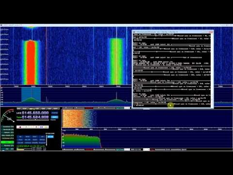
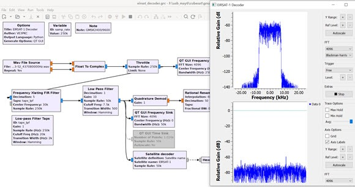
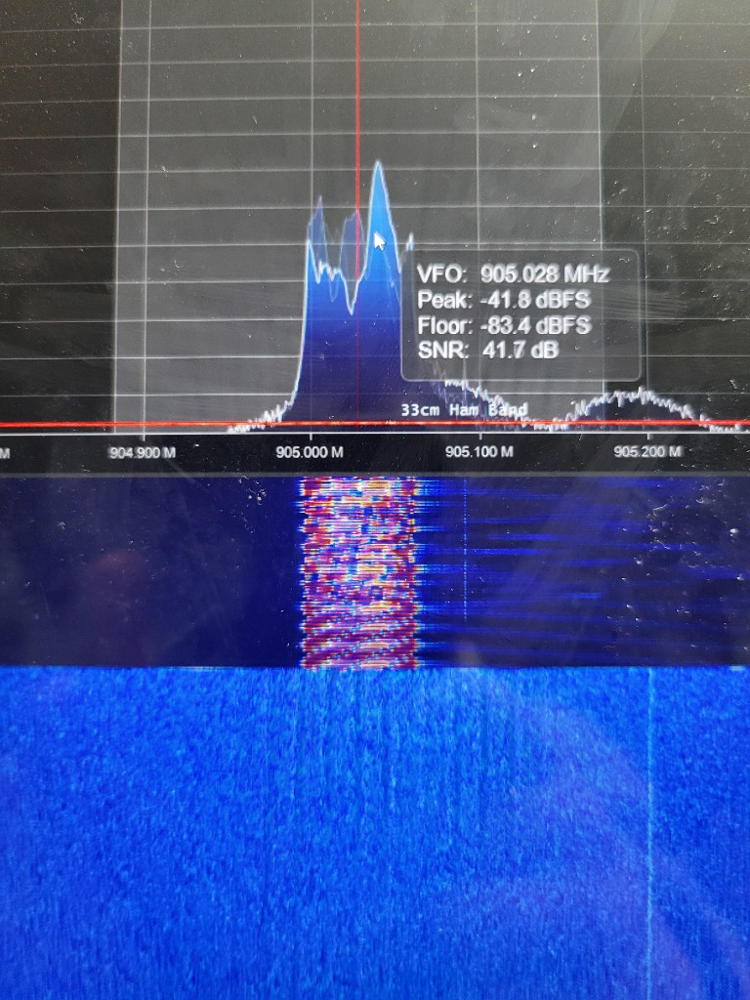

<div align="center">

# 🛰️ CubeSat Telemetry Decoder

**AX.25 · CCSDS · CSP · Raw Beacon Parser for Amateur CubeSats**

[](https://python.org)
[]()
[]()
[](https://github.com/DynamiX-Labs)

*Ground station telemetry decoder for 1U–6U CubeSats — batteries, ADCS, OBC, payload.*

</div>

---

## 📡 Overview

CubeSat-Telemetry-Decoder provides a complete ground station pipeline for receiving and parsing telemetry beacons from amateur CubeSats. Supports the most common amateur satellite protocols with extensible frame parsers.

```
RF Signal → RTL-SDR → GNU Radio → AX.25 Deframe → CCSDS/CSP Parse → Telemetry DB
                                        ↓
                              Callsign | SSID | PID
                              Battery V, Temp, Mode
                              ADCS attitude quaternion
                              OBC uptime / error flags
```

---

## 🔧 Supported Protocols

| Protocol | Description | Common Use |
|---|---|---|
| **AX.25 UI** | Unproxied Information frames | Most amateur CubeSats |
| **CCSDS TM** | Space Packet Protocol | NASA/ESA CubeSats |
| **CSP** | CubeSat Space Protocol | GomSpace platforms |
| **RAW** | Binary beacon (custom) | University CubeSats |

---

## ⚡ Quick Start

```bash
git clone https://github.com/DynamiX-Labs/CubeSat-Telemetry-Decoder.git
cd CubeSat-Telemetry-Decoder
pip install -r requirements.txt

# Decode from IQ file
python src/main.py decode --file samples/funcube1.iq --satellite FO-29

# Live decode from RTL-SDR
python src/main.py live --freq 435.800e6 --hardware rtlsdr --callsign "K4XYZ"

# Parse raw frame hex
python src/main.py parse --hex "82A0A4A6406096 ..."

# Launch ground station web UI
python src/ground_station/server.py --port 8080
```

---

## 🗂️ Supported Satellites

| Satellite | NORAD | Frequency | Protocol | Notes |
|---|---|---|---|---|
| FO-29 (JAS-2) | 24278 | 435.795 MHz | AX.25 | CW + digital |
| ISS APRS | 25544 | 145.825 MHz | AX.25 | Packet gateway |
| FUNCUBE-1 | 39444 | 145.935 MHz | AX.25 | 1200bd BPSK |
| LILACSAT-2 | 40908 | 437.200 MHz | CSP | 9600bd GMSK |
| LUCKY-7 | 44406 | 437.525 MHz | AX.25 | 4800bd GFSK |
| Custom | any | configurable | AX.25/RAW | Add your own |

---

## 📊 Telemetry Fields Parsed

```
EPS (Electrical Power System):
  battery_voltage_mv    Battery terminal voltage
  battery_current_ma    Charge/discharge current
  solar_panel_v[0..3]   Individual panel voltages
  temperature_c         Battery temperature

OBC (On-Board Computer):
  uptime_s              Seconds since last boot
  boot_count            Total reboot count
  error_flags           Fault register bitmap
  memory_free_kb        Available RAM

ADCS (Attitude):
  quaternion [w,x,y,z]  Attitude quaternion
  angular_rate [x,y,z]  Body rates (deg/s)
  magnetometer [x,y,z]  Magnetic field (μT)
```

---

## 🖼️ Gallery

Here are some examples of our telemetry decoding pipeline in action:

<div align="center">
  
  
  <br><br>
  
  
</div>

---

## 📄 License

MIT License — © 2025 DynamiX Labs
