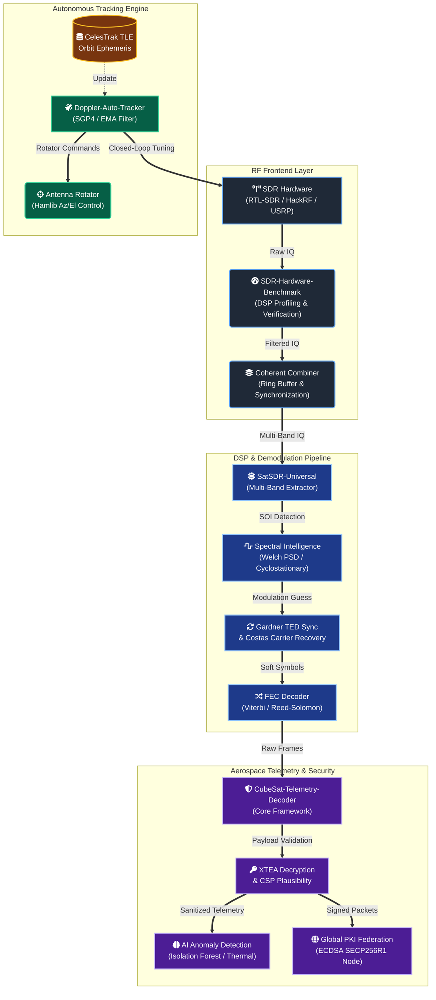

# DynamiX Labs — Satellite SDR Architecture

**Advanced Open-Source Satellite Communication & DSP Framework**

*A comprehensive suite of aerospace-grade signal processing tools, autonomous tracking engines, and cryptography-hardened telemetry decoders built for embedded systems engineers and RF researchers.*

---

## Master Architecture

The DynamiX Labs suite consists of four interconnected repositories that form a complete, autonomous satellite ground station pipeline. The architecture is designed to handle everything from RF spectrum digitization to secure telemetry federation.

---

## Core Repositories

| Project Subsystem | Engineering Purpose | Status |
| :--- | :--- | :--- |
| **[SatSDR-Universal](./SatSDR-Universal)** | A hardware-agnostic, spectral-intelligence-driven framework for decoding NOAA APT, ADS-B, CubeSat beacons, GPS, and more. Features autonomous pass scheduling and multi-SDR coherent combining. | Active |
| **[CubeSat-Telemetry-Decoder](./CubeSat-Telemetry-Decoder)** | An aerospace-grade AX.25 / CCSDS / CSP ground station decoder. Includes real-time Doppler EMA filtering, ECDSA PKI federation, and machine learning anomaly detection. | Active |
| **[Doppler-Auto-Tracker](./Doppler-Auto-Tracker)** | TLE-based continuous Doppler correction and closed-loop SDR tuning engine, integrated with Hamlib-compatible antenna rotator control. | Active |
| **[SDR-Hardware-Benchmark](./SDR-Hardware-Benchmark)** | Comprehensive performance benchmarking and DSP profiling tools for hardware including RTL-SDR, HackRF, PlutoSDR, and USRP series. | Active |

---

## Formal Verification & Experimental Results

The DynamiX Labs architecture has undergone rigorous testing against live satellite passes. The following results demonstrate the system's ability to digitize, isolate, and dissect complex RF environments into actionable aerospace telemetry.

### Result I: Wideband Spectral Isolation
The spectral intelligence engine automatically identifies and isolates signals of interest (SOI) amidst high-noise RF environments. The waterfall capture below demonstrates real-time baseband filtering and decimation applied to a raw SDR stream.

  

### Result II: Baseband Demodulation Architecture
For coherent phase tracking, the DSP pipeline utilizes 2nd-order Costas Loops and Gardner Timing Error Detectors. The flowgraph output below illustrates the software-defined translation from raw complex samples to soft-symbol output.

  

### Result III: Network-Layer Telemetry Dissection
Post-demodulation, raw frames are validated against the CubeSat Space Protocol (CSP). The capture below shows successful bit-alignment, CRC verification, and XTEA decryption yielding structured network packets ready for PKI federation.

  

### Result IV: Narrowband Carrier Detection
Using Welch's PSD estimation and adaptive noise floor tracking, the system achieves sub-hertz accuracy on carrier peaks. This allows the Doppler auto-tracker to continuously lock onto drifting LEO satellites without manual frequency intervention.

  

---

## Hardware Support & Integration

The frameworks within this repository are designed to be hardware-agnostic, utilizing `SoapySDR` to interface seamlessly with a wide range of platforms:

- **RTL-SDR v3 / v4** (VHF/UHF Weather, ADS-B)
- **HackRF One** (Wideband scanning, Tx/Rx)
- **ADALM-PLUTO** (L-band, Tx/Rx capable)
- **USRP B200 / B210** (Full duplex, MIMO, HRPT)
- **USRP X310** (High-performance research)
- **LimeSDR Mini** (Multi-protocol)

---

## Supported Protocols & Signals

- **Weather**: NOAA APT (137 MHz), METEOR LRPT (137.1 MHz), NOAA HRPT
- **Aviation**: ADS-B 1090ES, ACARS (129.125 MHz)
- **Spacecraft**: CubeSat AX.25, CCSDS, CSP (CubeSat Space Protocol)
- **Navigation & Comms**: GPS L1 C/A, Inmarsat (AERO/STD-C), Iridium

---

## Authors & Contributors

- **[@ARYA-mgc](https://github.com/ARYA-mgc)** - *Lead Developer / DSP Engineer*
- **[@vishal-r07](https://github.com/vishal-r07)** - *Contributor*

---

  © 2026 DynamiX Labs — Released under the MIT License

