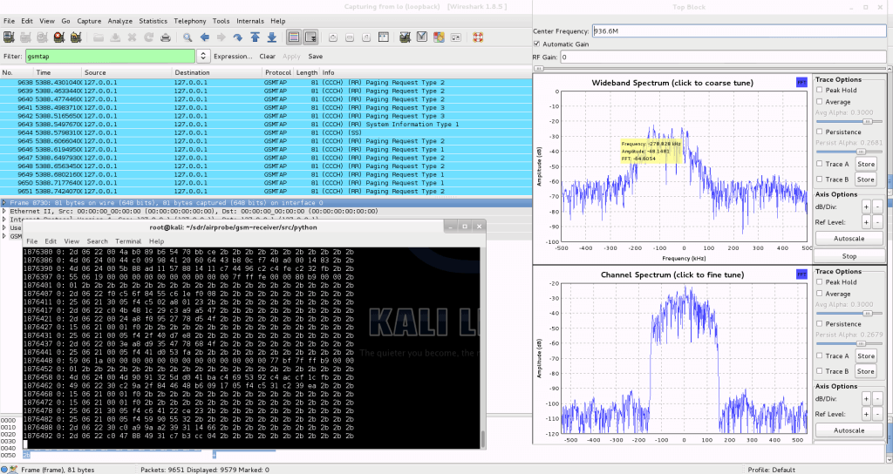

# 🛰️ DynamiX Labs — Satellite SDR Projects

**Open-source satellite communication & SDR tools for embedded systems engineers**

---

## 📦 Projects

| Repo | Description | Status |
|---|---|---|
| [SatSDR-Universal](./SatSDR-Universal) | Universal satellite signal decoder (NOAA APT, ADS-B, CubeSat, GPS) | ✅ Active |
| [CubeSat-Telemetry-Decoder](./CubeSat-Telemetry-Decoder) | AX.25 / CCSDS / CSP ground station decoder | ✅ Active |
| [Doppler-Auto-Tracker](./Doppler-Auto-Tracker) | TLE-based Doppler correction + antenna rotator control | ✅ Active |
| [SDR-Hardware-Benchmark](./SDR-Hardware-Benchmark) | Performance benchmarks for RTL-SDR, HackRF, PlutoSDR, USRP | ✅ Active |

---

## 🔧 Supported Hardware

RTL-SDR v3 · HackRF One · ADALM-PLUTO · USRP B200/B210 · USRP X310

## 📡 Supported Signals

NOAA APT · METEOR LRPT · ADS-B 1090ES · ACARS · CubeSat AX.25 · CCSDS · GPS L1 · Inmarsat · Iridium

---

## 🖼️ Gallery

Here are some examples of our decoding pipeline in action:

  
  
   
  
  

---

## 👥 Authors & Contributors

* **[@ARYA-mgc](https://github.com/ARYA-mgc)** - *Lead Developer*
* **[@vishal-r07](https://github.com/vishal-r07)** - *Contributor*

---

© 2026 DynamiX Labs — MIT License
