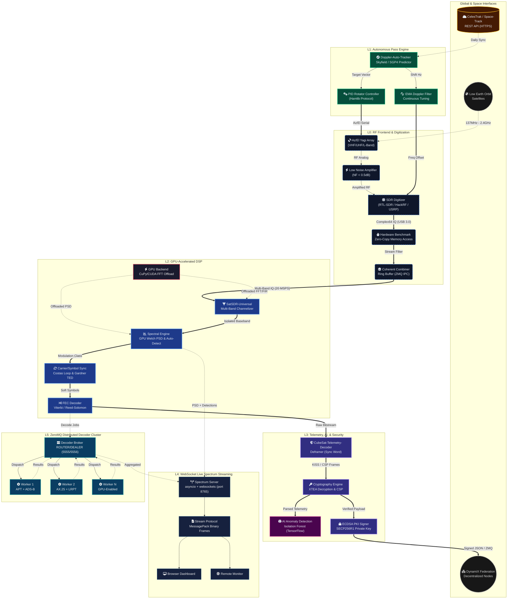
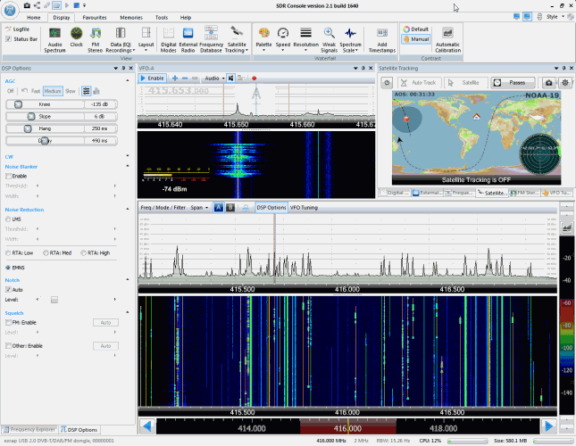
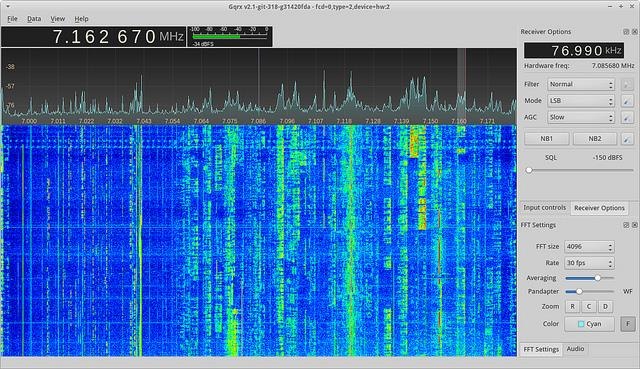
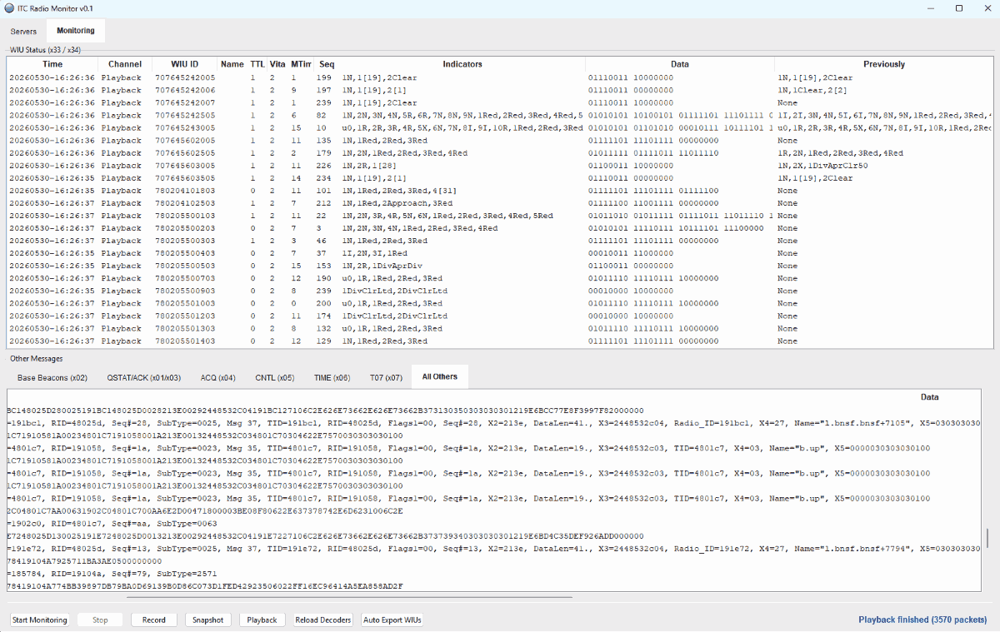
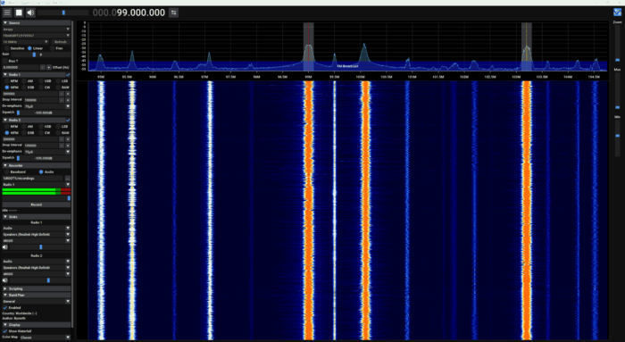

<div align="center">

# DynamiX Labs — Satellite SDR Architecture

**Open-Source Satellite Communication & Signal Processing Toolkit**

[](https://github.com/DynamiX-Labs)
[](https://python.org)
[](https://gnuradio.org)

</div>

## What is this?

DynamiX Labs started out as a weekend experiment — just trying to pull down a NOAA weather satellite image with a cheap RTL-SDR dongle and a homemade dipole antenna taped to a window. It worked (barely), and that one blurry APT image kicked off everything you see here.

The idea was simple: build an end-to-end ground station pipeline that could go from raw RF to decoded telemetry, without needing a $50k setup or a PhD to get it running. Something a college student could plug in and start receiving real satellite data on day one.

Over time it grew into four separate tools that all talk to each other — an SDR channelizer, a Doppler tracker, a telemetry decoder, and a hardware benchmark suite. This repo ties them all together under one roof.

> **Who is this for?** Students setting up their first ground station, amateur radio operators messing with satellite comms, CubeSat teams who need a decoder they can actually modify, or anyone who thinks pulling data out of thin air is cool (it is).

---

## How it all fits together

Here's the big picture. The signal comes off the antenna, gets digitized by whatever SDR hardware you have, passes through the DSP pipeline, and comes out the other end as clean decoded packets. Each layer is its own module so you can swap things in and out without breaking the rest.


```mermaid
flowchart TB
    %% Core Styling Directives
    classDef hardware fill:#0f172a,stroke:#3b82f6,stroke-width:2px,color:#e2e8f0,stroke-dasharray: 5 5
    classDef tracking fill:#064e3b,stroke:#10b981,stroke-width:2px,color:#e2e8f0
    classDef dsp fill:#1e3a8a,stroke:#60a5fa,stroke-width:2px,color:#e2e8f0
    classDef telemetry fill:#312e81,stroke:#a78bfa,stroke-width:2px,color:#e2e8f0
    classDef ai fill:#4a044e,stroke:#f472b6,stroke-width:2px,color:#e2e8f0
    classDef database fill:#451a03,stroke:#fbbf24,stroke-width:2px,color:#e2e8f0
    classDef external fill:#171717,stroke:#a3a3a3,stroke-width:2px,color:#d4d4d4
    classDef gpu fill:#1a1a2e,stroke:#e94560,stroke-width:2px,color:#eee
    classDef ws fill:#16213e,stroke:#0f3460,stroke-width:2px,color:#eee
    classDef zmq fill:#0a3d62,stroke:#38ada9,stroke-width:2px,color:#eee

    %% External Systems
    subgraph External_Network [Global & Space Interfaces]
        direction LR
        SAT((fa:fa-satellite Low Earth Orbit<br>Satellites)):::external
        TLE[("fa:fa-cloud CelesTrak / Space-Track<br>REST API (HTTPS)")]:::database
        FED_NET(("fa:fa-network-wired DynamiX Federation<br>Decentralized Nodes")):::external
    end

    %% RF Frontend
    subgraph RF_Layer [L0: RF Frontend & Digitization]
        direction TB
        ANT("fa:fa-satellite-dish Az/El Yagi Array<br>(VHF/UHF/L-Band)"):::hardware
        LNA("fa:fa-bolt Low Noise Amplifier<br>(NF < 0.5dB)"):::hardware
        HW["fa:fa-microchip SDR Digitizer<br>(RTL-SDR / HackRF / USRP)"]:::hardware
        BM("fa:fa-stopwatch Hardware Benchmark<br>Zero-Copy Memory Access"):::hardware
        COH("fa:fa-layer-group Coherent Combiner<br>Ring Buffer (ZMQ IPC)"):::hardware
        
        ANT -- RF Analog --> LNA
        LNA -- Amplified RF --> HW
        HW == "Complex64 IQ (USB 3.0)" ==> BM
        BM == "Stream Filter" ==> COH
    end

    %% Tracking Engine
    subgraph Auto_Tracking [L1: Autonomous Pass Engine]
        direction TB
        DT["fa:fa-compass Doppler-Auto-Tracker<br>Skyfield / SGP4 Predictor"]:::tracking
        PID["fa:fa-cogs PID Rotator Controller<br>(Hamlib Protocol)"]:::tracking
        EMA["fa:fa-wave-square EMA Doppler Filter<br>Continuous Tuning"]:::tracking

        DT -->|Target Vector| PID
        DT -->|Shift Hz| EMA
    end

    %% GPU-Accelerated DSP Pipeline
    subgraph DSP_Layer [L2: GPU-Accelerated DSP]
        direction TB
        GPU["fa:fa-bolt GPU Backend<br>CuPy/CUDA FFT Offload"]:::gpu
        SU["fa:fa-filter SatSDR-Universal<br>Multi-Band Channelizer"]:::dsp
        SPEC["fa:fa-chart-bar Spectral Engine<br>GPU Welch PSD & Auto-Detect"]:::dsp
        SYNC["fa:fa-sync Carrier/Symbol Sync<br>Costas Loop & Gardner TED"]:::dsp
        FEC["fa:fa-random FEC Decoder<br>Viterbi / Reed-Solomon"]:::dsp

        COH == "Multi-Band IQ (20 MSPS)" ==> SU
        GPU -.->|"Offloaded FFT/FIR"| SU
        GPU -.->|"Offloaded PSD"| SPEC
        SU == "Isolated Baseband" ==> SPEC
        SPEC == "Modulation Class" ==> SYNC
        SYNC == "Soft Symbols" ==> FEC
    end

    %% Telemetry & Security
    subgraph Telemetry_Layer [L3: Telemetry, AI, & Security]
        direction TB
        CTD["fa:fa-shield-alt CubeSat-Telemetry-Decoder<br>Deframer (Sync Word)"]:::telemetry
        CRYPTO["fa:fa-key Cryptography Engine<br>XTEA Decryption & CSP"]:::telemetry
        ANOMALY["fa:fa-brain AI Anomaly Detection<br>Isolation Forest (TensorFlow)"]:::ai
        PKI["fa:fa-lock ECDSA PKI Signer<br>SECP256R1 Private Key"]:::telemetry

        FEC == "Raw Bitstream" ==> CTD
        CTD == "KISS / CSP Frames" ==> CRYPTO
        CRYPTO == "Parsed Telemetry" ==> ANOMALY
        CRYPTO == "Verified Payload" ==> PKI
    end

    %% WebSocket Streaming
    subgraph Streaming_Layer [L4: WebSocket Live Spectrum Streaming]
        direction LR
        WSSRV["fa:fa-broadcast-tower Spectrum Server<br>asyncio + websockets (port 8765)"]:::ws
        PROTO["fa:fa-file-code Stream Protocol<br>MessagePack Binary Frames"]:::ws
        BROWSER["fa:fa-desktop Browser Dashboard"]:::ws
        REMOTE["fa:fa-globe Remote Monitor"]:::ws

        SPEC -.->|"PSD + Detections"| WSSRV
        WSSRV --> PROTO
        PROTO --> BROWSER
        PROTO --> REMOTE
    end

    %% Distributed Decoder Cluster
    subgraph Cluster_Layer [L5: ZeroMQ Distributed Decoder Cluster]
        direction LR
        BROKER["fa:fa-server Decoder Broker<br>ROUTER/DEALER (5555/5556)"]:::zmq
        W1["fa:fa-cog Worker 1<br>APT + ADS-B"]:::zmq
        W2["fa:fa-cog Worker 2<br>AX.25 + LRPT"]:::zmq
        WN["fa:fa-cog Worker N<br>GPU-Enabled"]:::zmq

        FEC -.->|"Decode Jobs"| BROKER
        BROKER -->|"Dispatch"| W1
        BROKER -->|"Dispatch"| W2
        BROKER -->|"Dispatch"| WN
        W1 & W2 & WN -.->|"Results"| BROKER
        BROKER -.->|"Aggregated"| WSSRV
    end

    %% Cross-Layer Integrations
    SAT -. "137MHz - 2.4GHz" .-> ANT
    TLE -. "Daily Sync" .-> DT
    EMA == "Freq Offset" ==> HW
    PID == "Az/El Serial" ==> ANT
    PKI == "Signed JSON / ZMQ" ==> FED_NET
```

---

## The four pieces

Each subsystem lives in its own directory and works independently, but they're designed to plug into each other when you need the full pipeline.

| Project | What it does | Status |
| :--- | :--- | :--- |
| **[SatSDR-Universal](./SatSDR-Universal)** | The main SDR engine. Takes raw IQ samples and figures out what signal you're looking at — NOAA weather, ADS-B aircraft, CubeSat beacons, whatever. It handles channelization, spectral detection, and can juggle multiple SDR dongles at once if you've got them. | Active |
| **[CubeSat-Telemetry-Decoder](./CubeSat-Telemetry-Decoder)** | Takes demodulated bits and turns them into actual telemetry packets. Handles AX.25, CCSDS, and CSP framing. Also does XTEA decryption if the satellite uses it, and has an anomaly detector that flags weird readings so you're not staring at logs all day. | Active |
| **[Doppler-Auto-Tracker](./Doppler-Auto-Tracker)** | Satellites move fast — a LEO pass might shift your signal by ±5 kHz. This tool grabs fresh TLE data, predicts where the bird will be, and continuously nudges your SDR frequency to stay locked on. Also drives antenna rotators via Hamlib if you've got a motorized setup. | Active |
| **[SDR-Hardware-Benchmark](./SDR-Hardware-Benchmark)** | Before you commit to a particular SDR dongle, you probably want to know how it actually performs. This runs throughput tests, measures dropped samples, checks CPU load, and compares SNR across different devices so you can pick the right one for your use case. | Active |

The benchmark tool spits out JSON and CSV reports — throughput, CPU load, SNR, EVM, all of it. Check `SDR-Hardware-Benchmark/README.md` for example runs.

---

## Does it actually work? — Results from real passes

We've tested this against live satellite passes. Not simulations, not recorded IQ files (well, those too for regression), but actual signals coming off the antenna. Here's what we got.

### Wideband spectral isolation
The first challenge is just finding the signal. The spectrum is noisy — other radios, thermal noise, interference from that one LED bulb in the hallway. The spectral engine scans the band, identifies peaks above the noise floor, and isolates each one for decoding.

<div align="center">
  
</div>

### Baseband demodulation
Once you've got the signal isolated, you need to demodulate it. We use a Costas loop for carrier recovery and a Gardner timing error detector for symbol sync. It's textbook DSP, but getting it stable on a noisy live signal took quite a bit of tuning.

<div align="center">
  
</div>

### Telemetry decoding
After demodulation, the raw bits go through the frame synchronizer. It finds the sync word, strips the framing, runs the CRC check, decrypts if needed, and hands you a clean CSP packet. This screenshot shows the decoded packets in Wireshark — proper structure, valid checksums, the works.

<div align="center">
  
</div>

### Narrowband carrier detection
For Doppler tracking, you need to know exactly where the carrier peak is. We use Welch's PSD estimation with adaptive noise floor tracking to get sub-hertz accuracy, which is enough to keep the auto-tracker locked on even during fast LEO passes.

<div align="center">
  
</div>

---

## Hardware we've tested with

Everything talks to the SDR through SoapySDR, so in theory any supported device should work. In practice, here's what we've actually tried and can vouch for:

- **RTL-SDR v3 / v4** — cheapest option, great for getting started. Handles NOAA APT and ADS-B just fine.
- **HackRF One** — wider bandwidth, can transmit too. Good for scanning large chunks of spectrum.
- **ADALM-PLUTO** — does L-band and has Tx/Rx, handy for Inmarsat experiments.
- **USRP B200 / B210** — this is where it gets serious. Full duplex, MIMO, enough bandwidth for HRPT.
- **USRP X310** — research-grade. Overkill for most people, but if you've got access to one, it's beautiful.
- **LimeSDR Mini** — decent middle ground, handles multiple protocols well.

If your SDR isn't on this list but works with SoapySDR, give it a try — it'll probably work.

### Quick Hardware Setup & Drivers

To quickly configure drivers and libraries for your SDR hardware, run our automated setup script or follow the step-by-step instructions in the [hardware-setup/](./hardware-setup) folder.

*   Supports **RTL-SDR**, **HackRF**, **ADALM-Pluto**, **USRP (UHD)**, and **LimeSDR**.
*   Configures udev rules for non-root USB access and establishes the SoapySDR software interfaces.


---

## Signals & protocols

Here's what the pipeline can currently decode (basic pipelines are working, some of the more exotic modes are still being built out):

- **Weather satellites** — NOAA APT at 137 MHz, METEOR LRPT at 137.1 MHz, and NOAA HRPT for the higher-res stuff
- **Aviation** — ADS-B on 1090 MHz (aircraft position/altitude), ACARS on 129.125 MHz (text messages from planes)
- **Spacecraft** — CubeSat beacons using AX.25, CCSDS, or CSP framing
- **Navigation & comms** — GPS L1 C/A (just acquisition for now), Inmarsat AERO/STD-C, and Iridium burst detection

We're actively adding more. If there's a protocol you'd like to see supported, open an issue — or better yet, a PR.

---

## Running with Docker

Don't want to install GNU Radio and a dozen system packages by hand? Fair enough. There's a Dockerfile in the `docker/` directory that sets up everything — Ubuntu 24.04, GNU Radio, SoapySDR, Hamlib, the whole stack.

```bash
cd docker
docker build -t dynamix-labs .
docker run -it --device=/dev/bus/usb dynamix-labs
```

You'll need to pass through your USB device so the container can talk to your SDR dongle.

---

## Who's building this

- **[@ARYA-mgc](https://github.com/ARYA-mgc)** — started the project, does most of the DSP and architecture work
- **[@Nithi-tech](https://github.com/Nithi-tech)** — contributor
- **[@ashwinr-act-cit](https://github.com/ashwinr-act-cit)** — contributor
- **[@jayarajMd](https://github.com/jayarajMd)** — contributor

We'd love more people involved. Check out [CONTRIBUTING.md](./CONTRIBUTING.md) if you want to help, and [SECURITY.md](./SECURITY.md) if you find something that looks like a vulnerability (please report it privately).

---


<div align="center">
  © 2026 DynamiX Labs — Apache License 2.0
</div>
