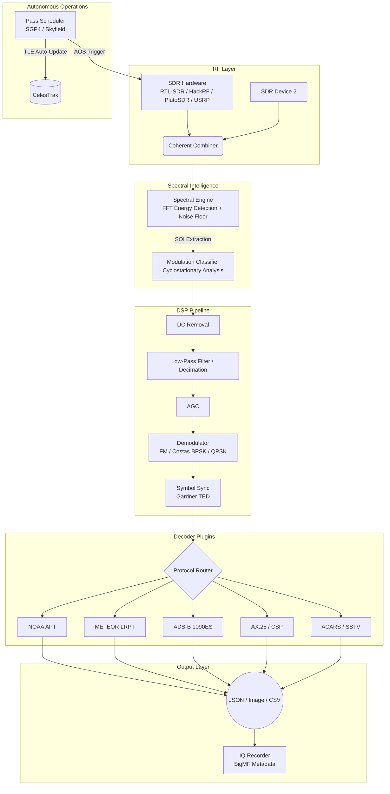

<div align="center">

# SatSDR-Universal

**Universal Satellite Signal Decoding Framework**

[](https://python.org)
[](https://gnuradio.org)
[](LICENSE)
[](https://github.com/DynamiX-Labs)

*A hardware-agnostic, spectral-intelligence-driven satellite signal processing framework. Decode weather satellites, aviation transponders, CubeSat telemetry, and GNSS from a unified, headless pipeline.*

</div>

---

## Architecture Overview

SatSDR-Universal is a professional-grade, headless satellite signal decoding framework. It goes beyond basic SDR scripting by introducing automated spectral intelligence for signal detection, multi-SDR coherent combining for simultaneous multi-band reception, and an autonomous pass scheduler that predicts satellite flyovers and triggers decode jobs without human intervention.

The system is designed as a composable DSP pipeline with a strict plugin architecture, allowing new satellite protocols to be integrated without modifying core code.

### Core System Architecture



---

## Advanced Capabilities

This framework is engineered for autonomous, unattended satellite ground station operation:

*   **Spectral Intelligence Engine**: Continuously scans the RF spectrum using Welch PSD estimation with an adaptive noise floor. Automatically detects signals of interest (SOI), estimates their bandwidth, and classifies the modulation type, routing directly to the correct decoder plugin without manual frequency input.
*   **Multi-SDR Coherent Combiner**: Manages multiple SDR devices simultaneously via thread-safe ring buffers. Each device can be tuned to a different band, enabling parallel reception of NOAA APT (137 MHz), ADS-B (1090 MHz), and CubeSat beacons (435 MHz) from a single ground station.
*   **Autonomous Pass Scheduler**: Fetches live TLE data from CelesTrak, propagates orbits using Skyfield/SGP4, and predicts satellite passes over the ground station. Automatically queues decoder jobs and triggers acquisition at AOS (Acquisition of Signal).
*   **IQ Recording with SigMF**: All live captures are automatically archived with SigMF-compliant metadata (frequency, sample rate, gain, hardware, timestamp). Supports gzip-compressed storage and precise replay for offline analysis.
*   **Hardened DSP Pipeline**: Features a composable block architecture with DC offset removal, FIR filtering, rational resampling, AGC, FM demodulation, 2nd-order Costas Loop carrier recovery for BPSK, and Gardner Timing Error Detector for symbol synchronization.

---

## Supported Satellite Categories

| Category | Signal Type | Frequency | Modulation | Decoder Plugin |
| :--- | :--- | :--- | :--- | :--- |
| **Weather (NOAA APT)** | Analog FM Image | 137.5 - 137.9 MHz | FM | `apt_decoder` |
| **Weather (METEOR-M)** | LRPT Digital Image | 137.1 MHz | QPSK | `lrpt_decoder` |
| **Aviation (ADS-B)** | Mode-S Transponder | 1090 MHz | PPM | `adsb_decoder` |
| **Aviation (ACARS)** | Airline Data Link | 129.125 MHz | AM/MSK | `acars_decoder` |
| **CubeSat Telemetry** | Beacon / Housekeeping | 435 - 438 MHz | BPSK/GMSK | `ax25_decoder` |
| **GPS/GNSS** | L1 C/A Navigation | 1575.42 MHz | BPSK | `gnss_decoder` |
| **Inmarsat** | Maritime / Aero | 1545 MHz | BPSK | `inmarsat_decoder` |
| **Iridium** | LEO Comms | 1616 - 1626 MHz | DQPSK | `iridium_decoder` |
| **NOAA HRPT** | High-Res Weather | 1698 - 1707 MHz | BPSK 665kbps | `hrpt_decoder` |
| **SSTV** | Slow-Scan TV | 14.230 MHz (HF) | FM | `sstv_decoder` |

---

## Hardware Compatibility

| Hardware | Max Bandwidth | Noise Figure | Optimal Use Case | Price Range |
| :--- | :--- | :--- | :--- | :--- |
| RTL-SDR v3 | 2.4 MHz | ~6 dB | VHF/UHF weather, ADS-B | ~$30 |
| HackRF One | 20 MHz | ~10 dB | Wideband scanning, Tx/Rx | ~$350 |
| ADALM-PLUTO | 20 MHz | ~8 dB | L-band, Tx/Rx capable | ~$200 |
| LimeSDR Mini | 30.72 MHz | ~5 dB | Multi-protocol, MIMO | ~$250 |
| USRP B200 | 56 MHz | ~5 dB | Research, HRPT | ~$700 |
| USRP B210 | 56 MHz (Dual) | ~5 dB | Full duplex, MIMO | ~$1,100 |
| Airspy R2 | 10 MHz | ~3.5 dB | High dynamic range VHF | ~$170 |

---

## Quick Start Guide

```bash
git clone https://github.com/DynamiX-Labs/SDR-Hardware-Benchmark.git
cd SDR-Hardware-Benchmark/SatSDR-Universal
pip install -r requirements.txt

# Decode NOAA APT from live SDR
python -m src.main decode --decoder apt --freq 137.5e6 --hardware rtlsdr

# Decode from IQ file
python -m src.main decode --decoder apt --iq-file samples/noaa15.iq --rate 250000

# Decode ADS-B live with HackRF
python -m src.main decode --decoder adsb --freq 1090e6 --hardware hackrf --gain 40

# List all available decoders
python -m src.main list-decoders

# Run DSP benchmark
python -m src.main benchmark --hardware rtlsdr --duration 30
```

---

## Project Structure

```
SatSDR-Universal/
├── src/
│   ├── main.py                      # CLI entry point
│   ├── decoders/
│   │   ├── base_decoder.py          # Abstract decoder interface
│   │   ├── apt_decoder.py           # NOAA APT weather images
│   │   ├── lrpt_decoder.py          # METEOR-M LRPT
│   │   ├── adsb_decoder.py          # ADS-B 1090 MHz
│   │   └── sstv_decoder.py          # Slow-Scan Television
│   ├── dsp/
│   │   ├── pipeline.py              # Composable DSP chain builder
│   │   └── spectral_engine.py       # Spectral Intelligence (auto-detect)
│   ├── scheduler/
│   │   └── pass_scheduler.py        # Autonomous pass prediction (SGP4)
│   └── utils/
│       ├── hardware.py              # SDR hardware abstraction (SoapySDR)
│       ├── iq_recorder.py           # SigMF-compliant IQ recording
│       └── coherent_combiner.py     # Multi-SDR parallel management
├── gnuradio/
│   ├── apt_rx.grc                   # NOAA APT flowgraph
│   ├── adsb_rx.grc                  # ADS-B flowgraph
│   └── lrpt_rx.grc                  # METEOR LRPT flowgraph
├── configs/
│   ├── hardware.yaml                # Hardware profiles
│   └── satellites.yaml              # Satellite frequency database
└── tests/
    ├── test_decoders.py
    └── test_dsp.py
```

---

## Plugin System

New decoders are added by inheriting from `BaseDecoder` and registering via YAML configuration. No core code modifications are required.

```python
from .base_decoder import BaseDecoder
import numpy as np
import json

class MyDecoder(BaseDecoder):
    NAME = "my_signal"
    FREQUENCY = 437.525e6
    MODULATION = "gmsk"
    BAUDRATE = 9600

    def decode(self, samples: np.ndarray) -> dict:
        # Custom decode logic
        return {"timestamp": ..., "payload": ...}

    def format_output(self, decoded: dict) -> str:
        return json.dumps(decoded, indent=2)
```

```yaml
# configs/decoders.yaml
plugins:
  - module: decoders.my_decoder
    class: MyDecoder
```

---

## DSP Pipeline

The composable pipeline allows any combination of processing blocks to be chained programmatically:

```python
from src.dsp.pipeline import Pipeline

pipe = Pipeline(sample_rate=250_000)
pipe.add_dc_removal()
pipe.add_lowpass(cutoff=100e3, num_taps=127)
pipe.add_decimate(factor=8)
pipe.add_agc(target=1.0)
pipe.add_costas_bpsk_demod(loop_bw=0.01)
pipe.add_gardner_ted(sps=4)

symbols = pipe.process(iq_samples)
```

---

## Performance Benchmarks

| Platform | Decoder | CPU Usage | Latency | Throughput |
| :--- | :--- | :--- | :--- | :--- |
| Raspberry Pi 5 | APT | 38% | 120ms | 250 kSPS |
| Intel i7-13700 | LRPT | 12% | 8ms | 2 MSPS |
| Jetson Nano | ADS-B | 55% | 45ms | 1 MSPS |
| Jetson Orin | HRPT | 22% | 12ms | 10 MSPS |

---

## Engineering Roadmap

### Phase 1: Core Intelligence
- [x] Spectral Intelligence Engine (FFT auto-detect + modulation classification)
- [x] DSP Pipeline Hardening (Costas Loop, Gardner TED, DC removal)

### Phase 2: Operational Autonomy
- [x] Automated Pass Scheduler (SGP4/Skyfield + CelesTrak TLE)
- [x] SigMF-compliant IQ Recording and Replay Engine
- [x] Multi-SDR Coherent Combiner (parallel multi-band reception)

### Phase 3: Future
- [ ] GPU-accelerated DSP (CuPy/CUDA FFT offload)
- [ ] WebSocket live spectrum streaming API
- [ ] Distributed decoder cluster (ZeroMQ work distribution)

---

## License

MIT License -- Copyright 2026 DynamiX Labs
</div>
