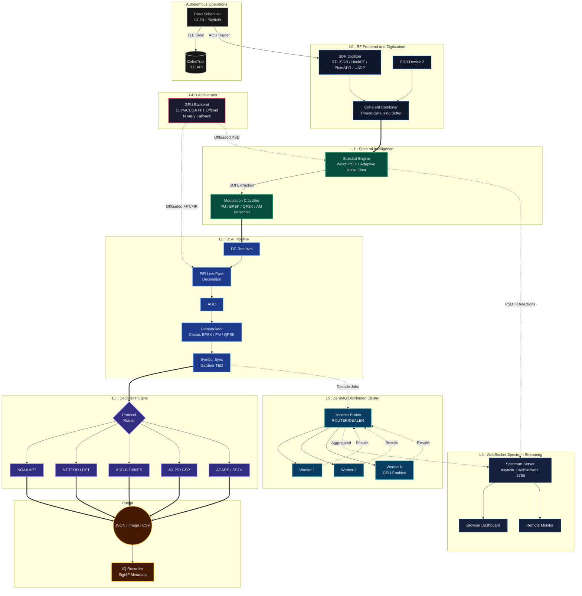
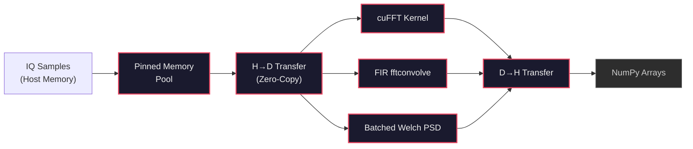
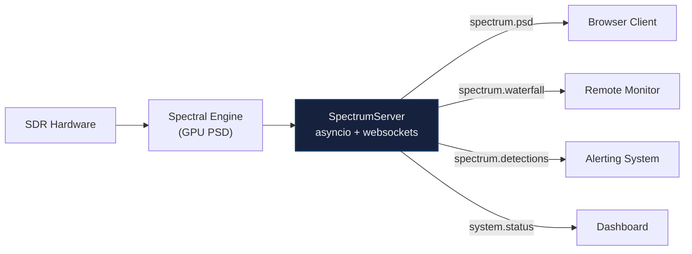
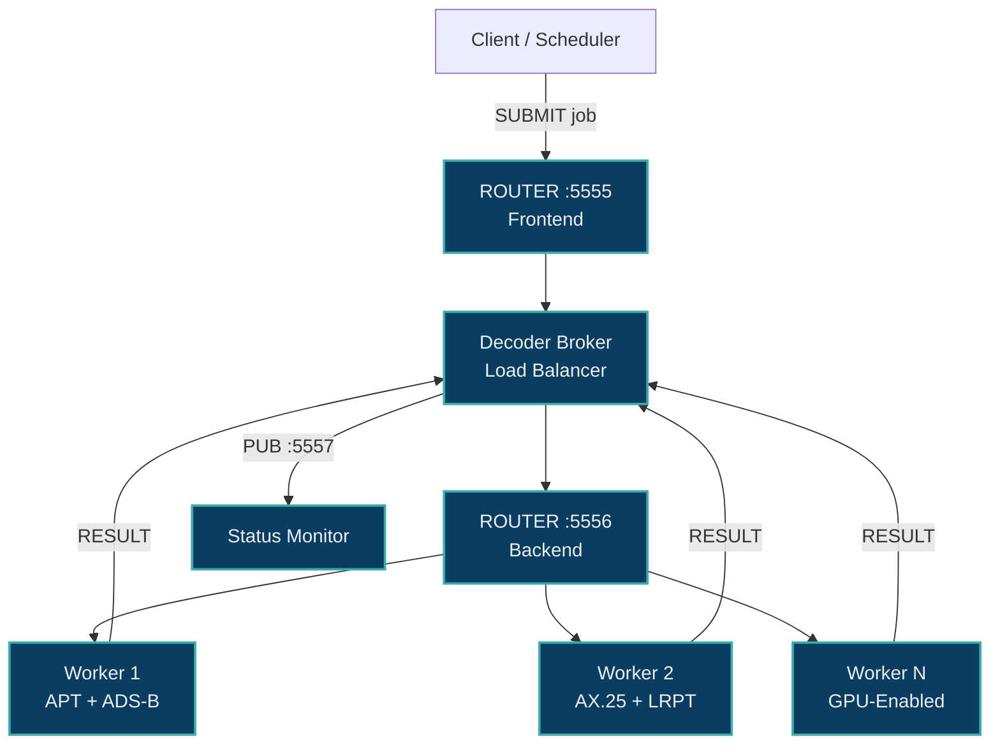
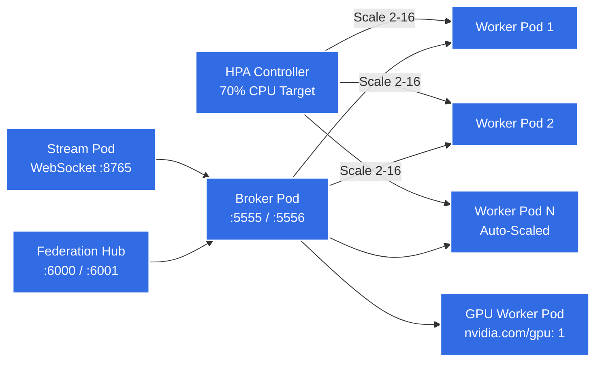
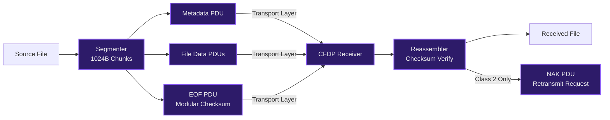
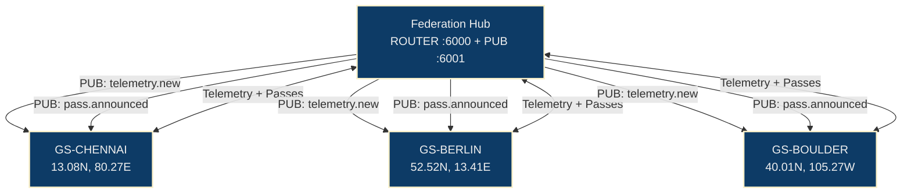

<div align="center">

# SatSDR-Universal

**Universal Satellite Signal Decoding Framework**

[](https://python.org)
[](https://gnuradio.org)
[](LICENSE)
[](https://github.com/DynamiX-Labs)

*A hardware-agnostic, spectral-intelligence-driven satellite signal processing framework. Decode weather satellites, aviation transponders, CubeSat telemetry, and GNSS from a unified, headless pipeline.*

**This project is API-only and CLI-driven. No web frontend, dashboard, or GUI is provided. All interaction is via the command-line interface, WebSocket API, and ZeroMQ sockets. Users build their own applications on top of these APIs.**

</div>

---

## Architecture Overview

SatSDR-Universal is a professional-grade, headless satellite signal decoding framework. It goes beyond basic SDR scripting by introducing automated spectral intelligence for signal detection, multi-SDR coherent combining for simultaneous multi-band reception, and an autonomous pass scheduler that predicts satellite flyovers and triggers decode jobs without human intervention.

The system is designed as a composable DSP pipeline with a strict plugin architecture, allowing new satellite protocols to be integrated without modifying core code.

### Core System Architecture


```mermaid
flowchart TB
    classDef hw fill:#0f172a,stroke:#3b82f6,stroke-width:2px,color:#e2e8f0,stroke-dasharray: 5 5
    classDef spectral fill:#064e3b,stroke:#10b981,stroke-width:2px,color:#e2e8f0
    classDef dsp fill:#1e3a8a,stroke:#60a5fa,stroke-width:2px,color:#e2e8f0
    classDef decode fill:#312e81,stroke:#a78bfa,stroke-width:2px,color:#e2e8f0
    classDef gpu fill:#1a1a2e,stroke:#e94560,stroke-width:2px,color:#eee
    classDef ws fill:#16213e,stroke:#0f3460,stroke-width:2px,color:#eee
    classDef zmq fill:#0a3d62,stroke:#38ada9,stroke-width:2px,color:#eee
    classDef out fill:#451a03,stroke:#fbbf24,stroke-width:2px,color:#e2e8f0
    classDef ext fill:#171717,stroke:#a3a3a3,stroke-width:2px,color:#d4d4d4

    subgraph L0 ["L0 : RF Frontend and Digitization"]
        direction LR
        SDR["SDR Digitizer\nRTL-SDR / HackRF / PlutoSDR / USRP"]:::hw
        SDR2["SDR Device 2"]:::hw
        COH["Coherent Combiner\nThread-Safe Ring Buffer"]:::hw
        SDR & SDR2 --> COH
    end

    subgraph L1 ["L1 : Spectral Intelligence"]
        direction LR
        SPEC["Spectral Engine\nWelch PSD + Adaptive Noise Floor"]:::spectral
        MOD["Modulation Classifier\nFM / BPSK / QPSK / AM Detection"]:::spectral
        SPEC -->|"SOI Extraction"| MOD
    end

    subgraph GPUBACK ["GPU Accelerator"]
        direction TB
        GPU["GPU Backend\nCuPy/CUDA FFT Offload\nNumPy Fallback"]:::gpu
    end

    subgraph L2 ["L2 : DSP Pipeline"]
        direction LR
        DC["DC Removal"]:::dsp
        LPF["FIR Low-Pass\nDecimation"]:::dsp
        AGC["AGC"]:::dsp
        DEMOD["Demodulator\nCostas BPSK / FM / QPSK"]:::dsp
        TED["Symbol Sync\nGardner TED"]:::dsp
        DC --> LPF --> AGC --> DEMOD --> TED
    end

    subgraph L3 ["L3 : Decoder Plugins"]
        direction LR
        ROUTER{"Protocol\nRouter"}:::decode
        APT["NOAA APT"]:::decode
        LRPT["METEOR LRPT"]:::decode
        ADSB["ADS-B 1090ES"]:::decode
        AX25["AX.25 / CSP"]:::decode
        SSTV["ACARS / SSTV"]:::decode
        ROUTER --> APT & LRPT & ADSB & AX25 & SSTV
    end

    subgraph L4 ["L4 : WebSocket Spectrum Streaming"]
        direction LR
        WSSRV["Spectrum Server\nasyncio + websockets :8765"]:::ws
        DASH["Browser Dashboard"]:::ws
        RMON["Remote Monitor"]:::ws
        WSSRV --> DASH & RMON
    end

    subgraph L5 ["L5 : ZeroMQ Distributed Cluster"]
        direction LR
        BROKER["Decoder Broker\nROUTER/DEALER"]:::zmq
        W1["Worker 1"]:::zmq
        W2["Worker 2"]:::zmq
        WN["Worker N\nGPU-Enabled"]:::zmq
        BROKER --> W1 & W2 & WN
    end

    subgraph OUTPUT ["Output"]
        direction LR
        OUT(("JSON / Image / CSV")):::out
        IQR["IQ Recorder\nSigMF Metadata"]:::out
        OUT --> IQR
    end

    subgraph AUTO ["Autonomous Operations"]
        direction LR
        SCHED["Pass Scheduler\nSGP4 / Skyfield"]:::ext
        TLE[("CelesTrak\nTLE API")]:::ext
        SCHED -->|"TLE Sync"| TLE
    end

    COH ==> SPEC
    MOD ==> DC
    GPU -.->|"Offloaded FFT/FIR"| LPF
    GPU -.->|"Offloaded PSD"| SPEC
    TED ==> ROUTER
    APT & LRPT & ADSB & AX25 & SSTV ==> OUT
    SPEC -.->|"PSD + Detections"| WSSRV
    TED -.->|"Decode Jobs"| BROKER
    W1 & W2 & WN -.->|"Results"| BROKER
    BROKER -.->|"Aggregated"| WSSRV
    SCHED -->|"AOS Trigger"| SDR
```

---

## Advanced Capabilities

This framework is engineered for autonomous, unattended satellite ground station operation:

*   **Spectral Intelligence Engine**: Continuously scans the RF spectrum using Welch PSD estimation with an adaptive noise floor. Automatically detects signals of interest (SOI), estimates their bandwidth, and classifies the modulation type, routing directly to the correct decoder plugin without manual frequency input.
*   **Multi-SDR Coherent Combiner**: Manages multiple SDR devices simultaneously via thread-safe ring buffers. Each device can be tuned to a different band, enabling parallel reception of NOAA APT (137 MHz), ADS-B (1090 MHz), and CubeSat beacons (435 MHz) from a single ground station.
*   **Autonomous Pass Scheduler**: Fetches live TLE data from CelesTrak, propagates orbits using Skyfield/SGP4, and predicts satellite passes over the ground station. Automatically queues decoder jobs and triggers acquisition at AOS (Acquisition of Signal).
*   **IQ Recording with SigMF**: All live captures are automatically archived with SigMF-compliant metadata (frequency, sample rate, gain, hardware, timestamp). Supports gzip-compressed storage and precise replay for offline analysis.
*   **Hardened DSP Pipeline**: Features a composable block architecture with DC offset removal, FIR filtering, rational resampling, AGC, FM demodulation, 2nd-order Costas Loop carrier recovery for BPSK, and Gardner Timing Error Detector for symbol synchronization.

---

## Supported Satellite Categories

| Category | Signal Type | Frequency | Modulation | Decoder Plugin |
| :--- | :--- | :--- | :--- | :--- |
| **Weather (NOAA APT)** | Analog FM Image | 137.5 - 137.9 MHz | FM | `apt_decoder` |
| **Weather (METEOR-M)** | LRPT Digital Image | 137.1 MHz | QPSK | `lrpt_decoder` |
| **Aviation (ADS-B)** | Mode-S Transponder | 1090 MHz | PPM | `adsb_decoder` |
| **Aviation (ACARS)** | Airline Data Link | 129.125 MHz | AM/MSK | `acars_decoder` |
| **CubeSat Telemetry** | Beacon / Housekeeping | 435 - 438 MHz | BPSK/GMSK | `ax25_decoder` |
| **GPS/GNSS** | L1 C/A Navigation | 1575.42 MHz | BPSK | `gnss_decoder` |
| **Inmarsat** | Maritime / Aero | 1545 MHz | BPSK | `inmarsat_decoder` |
| **Iridium** | LEO Comms | 1616 - 1626 MHz | DQPSK | `iridium_decoder` |
| **NOAA HRPT** | High-Res Weather | 1698 - 1707 MHz | BPSK 665kbps | `hrpt_decoder` |
| **SSTV** | Slow-Scan TV | 14.230 MHz (HF) | FM | `sstv_decoder` |

---

## Hardware Compatibility

| Hardware | Max Bandwidth | Noise Figure | Optimal Use Case | Price Range |
| :--- | :--- | :--- | :--- | :--- |
| RTL-SDR v3 | 2.4 MHz | ~6 dB | VHF/UHF weather, ADS-B | ~$30 |
| HackRF One | 20 MHz | ~10 dB | Wideband scanning, Tx/Rx | ~$350 |
| ADALM-PLUTO | 20 MHz | ~8 dB | L-band, Tx/Rx capable | ~$200 |
| LimeSDR Mini | 30.72 MHz | ~5 dB | Multi-protocol, MIMO | ~$250 |
| USRP B200 | 56 MHz | ~5 dB | Research, HRPT | ~$700 |
| USRP B210 | 56 MHz (Dual) | ~5 dB | Full duplex, MIMO | ~$1,100 |
| Airspy R2 | 10 MHz | ~3.5 dB | High dynamic range VHF | ~$170 |

---

## Quick Start Guide

```bash
git clone https://github.com/DynamiX-Labs/SDR-Hardware-Benchmark.git
cd SDR-Hardware-Benchmark/SatSDR-Universal
pip install -r requirements.txt

# Decode NOAA APT from live SDR
python -m src.main decode --decoder apt --freq 137.5e6 --hardware rtlsdr

# Decode from IQ file
python -m src.main decode --decoder apt --iq-file samples/noaa15.iq --rate 250000

# Decode ADS-B live with HackRF
python -m src.main decode --decoder adsb --freq 1090e6 --hardware hackrf --gain 40

# List all available decoders
python -m src.main list-decoders

# Run DSP benchmark
python -m src.main benchmark --hardware rtlsdr --duration 30
```

---

## Project Structure

```
SatSDR-Universal/
├── src/
│   ├── main.py                      # CLI entry point (decode, stream, broker, worker, cfdp, federation)
│   ├── decoders/
│   │   ├── base_decoder.py          # Abstract decoder interface
│   │   ├── apt_decoder.py           # NOAA APT weather images
│   │   ├── lrpt_decoder.py          # METEOR-M LRPT
│   │   ├── adsb_decoder.py          # ADS-B 1090 MHz
│   │   └── sstv_decoder.py          # Slow-Scan Television
│   ├── dsp/
│   │   ├── pipeline.py              # Composable DSP chain builder (GPU-aware)
│   │   ├── spectral_engine.py       # Spectral Intelligence (auto-detect)
│   │   └── gpu_backend.py           # CuPy/CUDA FFT offload + NumPy fallback
│   ├── streaming/
│   │   ├── spectrum_server.py       # WebSocket live spectrum server (asyncio)
│   │   └── stream_protocol.py       # Binary wire protocol (MessagePack frames)
│   ├── cluster/
│   │   ├── broker.py                # ZeroMQ ROUTER/DEALER job broker
│   │   ├── worker.py                # Distributed decoder worker node
│   │   └── models.py                # Shared data models (DecodeJob, WorkerInfo)
│   ├── protocols/
│   │   └── cfdp.py                  # CCSDS CFDP file delivery (Class 1 & 2)
│   ├── federation/
│   │   └── __init__.py              # Multi-node ground station federation
│   ├── scheduler/
│   │   └── pass_scheduler.py        # Autonomous pass prediction (SGP4)
│   └── utils/
│       ├── hardware.py              # SDR hardware abstraction (SoapySDR)
│       ├── iq_recorder.py           # SigMF-compliant IQ recording
│       └── coherent_combiner.py     # Multi-SDR parallel management
├── k8s/
│   └── satsdr-cluster.yaml          # Kubernetes manifests (HPA autoscaling)
├── gnuradio/
│   ├── apt_rx.grc                   # NOAA APT flowgraph
│   ├── adsb_rx.grc                  # ADS-B flowgraph
│   └── lrpt_rx.grc                  # METEOR LRPT flowgraph
├── configs/
│   ├── hardware.yaml                # Hardware profiles
│   ├── satellites.yaml              # Satellite frequency database
│   └── cluster.yaml                 # Distributed cluster configuration
└── tests/
    ├── test_gpu_backend.py          # GPU/CPU DSP backend tests
    ├── test_spectrum_server.py      # WebSocket protocol tests
    ├── test_cluster.py              # Distributed cluster tests
    └── test_phase4.py               # CFDP + Federation tests
```

---

## Plugin System

New decoders are added by inheriting from `BaseDecoder` and registering via YAML configuration. No core code modifications are required.

```python
from .base_decoder import BaseDecoder
import numpy as np
import json

class MyDecoder(BaseDecoder):
    NAME = "my_signal"
    FREQUENCY = 437.525e6
    MODULATION = "gmsk"
    BAUDRATE = 9600

    def decode(self, samples: np.ndarray) -> dict:
        # Custom decode logic
        return {"timestamp": ..., "payload": ...}

    def format_output(self, decoded: dict) -> str:
        return json.dumps(decoded, indent=2)
```

```yaml
# configs/decoders.yaml
plugins:
  - module: decoders.my_decoder
    class: MyDecoder
```

---

## DSP Pipeline

The composable pipeline allows any combination of processing blocks to be chained programmatically. GPU acceleration is transparent — the same API works on CPU and CUDA:

```python
from src.dsp.pipeline import Pipeline
from src.dsp.gpu_backend import GPUBackend

# GPU-accelerated pipeline (auto-fallback to CPU if no CUDA)
gpu = GPUBackend()
pipe = Pipeline(sample_rate=250_000, gpu_backend=gpu)
pipe.add_dc_removal()
pipe.add_lowpass(cutoff=100e3, num_taps=127)  # GPU FIR filter
pipe.add_decimate(factor=8)
pipe.add_agc(target=1.0)
pipe.add_costas_bpsk_demod(loop_bw=0.01)
pipe.add_gardner_ted(sps=4)

symbols = pipe.process(iq_samples)
print(pipe.info())  # Pipeline [GPU] [dc_removal -> lowpass_gpu -> ...]
```

---

## Phase 3: GPU-Accelerated DSP

The GPU backend transparently offloads compute-intensive operations to CUDA via CuPy, with automatic NumPy/SciPy fallback on CPU-only systems.


```mermaid
graph LR
    classDef gpu fill:#1a1a2e,stroke:#e94560,stroke-width:2px,color:#eee
    classDef cpu fill:#2d2d2d,stroke:#666,stroke-width:1px,color:#ccc

    IQ["IQ Samples\n(Host Memory)"] --> PIN["Pinned Memory\nPool"]:::gpu
    PIN --> XFER["H→D Transfer\n(Zero-Copy)"]:::gpu
    XFER --> FFT["cuFFT Kernel"]:::gpu
    XFER --> FIR["FIR fftconvolve"]:::gpu
    XFER --> PSD["Batched Welch PSD"]:::gpu
    FFT & FIR & PSD --> RES["D→H Transfer"]:::gpu
    RES --> OUT["NumPy Arrays"]:::cpu
```

**Capabilities:**
- FFT / IFFT with batched 2-D kernel launches
- FIR filtering via frequency-domain convolution
- Welch PSD estimation with GPU-accelerated periodogram averaging
- Cross-correlation via `cupyx.scipy.signal.fftconvolve`
- Performance telemetry (kernel time, transfer latency, VRAM usage)

```python
from src.dsp.gpu_backend import GPUBackend

with GPUBackend(device_id=0) as gpu:
    spectrum = gpu.fft(iq_samples)
    freqs, psd = gpu.welch_psd(iq_samples, fs=250e3, nperseg=4096)
    filtered = gpu.fir_filter(iq_samples, taps)
    print(gpu.metrics.snapshot())
```

---

## Phase 3: WebSocket Live Spectrum Streaming

Real-time RF spectrum distribution to browser-based or remote monitoring clients via async WebSocket.


```mermaid
graph LR
    classDef ws fill:#16213e,stroke:#0f3460,stroke-width:2px,color:#eee
    SDR["SDR Hardware"] --> ENG["Spectral Engine\n(GPU PSD)"]
    ENG --> SRV["SpectrumServer\nasyncio + websockets"]:::ws
    SRV --> |"spectrum.psd"| C1["Browser Client"]
    SRV --> |"spectrum.waterfall"| C2["Remote Monitor"]
    SRV --> |"spectrum.detections"| C3["Alerting System"]
    SRV --> |"system.status"| C4["Dashboard"]
```

**Features:**
- **Binary wire protocol** (MessagePack + zlib compression) for maximum throughput
- **4 subscription channels:** `spectrum.psd`, `spectrum.waterfall`, `spectrum.detections`, `system.status`
- Per-client subscriptions with binary or JSON text mode
- Configurable frame rate throttling (adaptive under load)
- Optional JWT / API-key authentication
- HTTP health endpoint at `/api/health`

```bash
# Start the spectrum streaming server
python -m src.main stream --port 8765 --fps 30 --fft-size 4096 --gpu
```

---

## Phase 3: Distributed Decoder Cluster

ZeroMQ-based work distribution that enables multiple decoder workers across machines to process satellite passes in parallel.


```mermaid
graph TB
    classDef zmq fill:#0a3d62,stroke:#38ada9,stroke-width:2px,color:#eee
    CLI["Client / Scheduler"] -->|"SUBMIT job"| FE["ROUTER :5555\nFrontend"]:::zmq
    FE --> BRK["Decoder Broker\nLoad Balancer"]:::zmq
    BRK --> BE["ROUTER :5556\nBackend"]:::zmq
    BE --> W1["Worker 1\nAPT + ADS-B"]:::zmq
    BE --> W2["Worker 2\nAX.25 + LRPT"]:::zmq
    BE --> W3["Worker N\nGPU-Enabled"]:::zmq
    W1 & W2 & W3 -->|"RESULT"| BRK
    BRK -->|"PUB :5557"| MON["Status Monitor"]:::zmq
```

**Features:**
- **ROUTER/DEALER** pattern for load-balanced, capability-aware dispatch
- Worker heartbeat monitoring with automatic dead-worker reaping
- Job lifecycle: `QUEUED → DISPATCHED → RUNNING → COMPLETE | FAILED`
- Automatic retry with configurable `max_retries`
- GPU-aware routing (FFT-heavy decoders prefer GPU workers)
- Thread-pool worker concurrency with graceful shutdown

```bash
# Terminal 1: Start the job broker
python -m src.main broker --frontend tcp://*:5555 --backend tcp://*:5556

# Terminal 2: Start a worker node
python -m src.main worker --broker-addr tcp://localhost:5556 --gpu --concurrency 4

# Terminal 3: Start another worker (different machine or capabilities)
python -m src.main worker --broker-addr tcp://broker-host:5556 --capabilities apt,lrpt
```

---

## Phase 4: Kubernetes-Native Decoder Autoscaling

Production-ready Kubernetes manifests with HorizontalPodAutoscaler for elastic decoder worker scaling. API-only — no web dashboard is provided; monitor via `kubectl` or your own observability stack.


```mermaid
flowchart LR
    classDef k8s fill:#326ce5,stroke:#fff,stroke-width:2px,color:#fff

    HPA["HPA Controller\n70% CPU Target"]:::k8s
    BROKER["Broker Pod\n:5555 / :5556"]:::k8s
    W1["Worker Pod 1"]:::k8s
    W2["Worker Pod 2"]:::k8s
    WN["Worker Pod N\nAuto-Scaled"]:::k8s
    GPU["GPU Worker Pod\nnvidia.com/gpu: 1"]:::k8s
    STREAM["Stream Pod\nWebSocket :8765"]:::k8s
    FED["Federation Hub\n:6000 / :6001"]:::k8s

    HPA -->|"Scale 2-16"| W1 & W2 & WN
    BROKER --> W1 & W2 & WN & GPU
    STREAM --> BROKER
    FED --> BROKER
```

**Components:**
- **Broker Deployment** — single replica ROUTER/DEALER with TCP health probes
- **CPU Worker Deployment** — HPA scales 2-16 replicas at 70% CPU utilization
- **GPU Worker Deployment** — `nodeSelector: nvidia.com/gpu.present` with CUDA image
- **Spectrum Streaming** — WebSocket API service on port 8765
- **Federation Hub** — ROUTER :6000 + PUB :6001 services

```bash
# Deploy the full cluster
kubectl apply -f k8s/satsdr-cluster.yaml

# Monitor autoscaling
kubectl get hpa -n satsdr -w

# Check worker pod count
kubectl get pods -n satsdr -l component=worker
```

---

## Phase 4: CCSDS File Delivery Protocol (CFDP)

CCSDS 727.0-B-5 compliant file delivery for CubeSat uplink/downlink operations. Supports Class 1 (unreliable) and Class 2 (reliable with ACK/NAK) transmission. API-only — integrate with any transport layer.


```mermaid
flowchart LR
    classDef cfdp fill:#2d1b69,stroke:#8b5cf6,stroke-width:2px,color:#eee

    FILE["Source File"] --> SEG["Segmenter\n1024B Chunks"]:::cfdp
    SEG --> META["Metadata PDU"]:::cfdp
    SEG --> DATA["File Data PDUs"]:::cfdp
    SEG --> EOF["EOF PDU\nModular Checksum"]:::cfdp
    META & DATA & EOF -->|"Transport Layer"| RX["CFDP Receiver"]:::cfdp
    RX --> REASM["Reassembler\nChecksum Verify"]:::cfdp
    REASM --> OUT["Received File"]
    REASM -->|"Class 2 Only"| NAK["NAK PDU\nRetransmit Request"]:::cfdp
```

**Features:**
- PDU encoding/decoding per CCSDS 727.0-B-5 (Metadata, FileData, EOF, NAK, Finished)
- CCSDS modular checksum (32-bit) for file integrity verification
- Transaction lifecycle tracking with progress reporting
- Transport-agnostic — plug in ZeroMQ, TCP, UDP, or CCSDS TM/TC

```bash
# Send a file via CFDP Class 1 (unreliable)
python -m src.main cfdp-send -s telemetry.bin -d /onboard/logs/telemetry.bin

# Class 2 (reliable with ACK/NAK)
python -m src.main cfdp-send -s firmware.bin --mode class2 --segment-size 512
```

```python
# Programmatic API
from src.protocols.cfdp import CFDPSender, CFDPReceiver, TransmissionMode

sender = CFDPSender(entity_id=1, peer_id=2, transport=my_zmq_send)
tx_id = sender.put("payload.bin", destination_path="/data/payload.bin")
print(sender.get_transaction(tx_id))  # Transaction status dict
```

---

## Phase 4: Multi-Node Federated Ground Station Network

Peer-to-peer telemetry sharing and coordinated pass scheduling across geographically distributed ground stations. API-only — all data exchanged via ZeroMQ PUB/SUB.


```mermaid
flowchart TB
    classDef fed fill:#0d3b66,stroke:#faf0ca,stroke-width:2px,color:#eee

    HUB["Federation Hub\nROUTER :6000 + PUB :6001"]:::fed
    GS1["GS-CHENNAI\n13.08N, 80.27E"]:::fed
    GS2["GS-BERLIN\n52.52N, 13.41E"]:::fed
    GS3["GS-BOULDER\n40.01N, 105.27W"]:::fed

    GS1 <-->|"Telemetry + Passes"| HUB
    GS2 <-->|"Telemetry + Passes"| HUB
    GS3 <-->|"Telemetry + Passes"| HUB

    HUB -->|"PUB: telemetry.new"| GS1 & GS2 & GS3
    HUB -->|"PUB: pass.announced"| GS1 & GS2 & GS3
```

**Features:**
- **Station Registration** with coordinates, capabilities, and hardware inventory
- **Telemetry Sharing** — broadcast decoded frames to all federated stations
- **Pass Coordination** — announce upcoming passes, claim assignments to avoid overlap
- **Heartbeat Monitoring** — automatic offline detection after 60s inactivity
- Event-driven callback system for custom integrations

```bash
# Terminal 1: Start the federation hub
python -m src.main federation-hub --bind tcp://*:6000 --pub tcp://*:6001

# Terminal 2: Join as a ground station node
python -m src.main federation-node --station-id GS-CHENNAI --lat 13.08 --lon 80.27 \
    --capabilities apt,adsb,ax25

# Terminal 3: Another station on a different continent
python -m src.main federation-node --station-id GS-BERLIN --lat 52.52 --lon 13.41
```

---

## Performance Benchmarks

| Platform | Decoder | CPU Usage | Latency | Throughput |
| :--- | :--- | :--- | :--- | :--- |
| Raspberry Pi 5 | APT | 38% | 120ms | 250 kSPS |
| Intel i7-13700 | LRPT | 12% | 8ms | 2 MSPS |
| Jetson Nano | ADS-B | 55% | 45ms | 1 MSPS |
| Jetson Orin | HRPT | 22% | 12ms | 10 MSPS |
| RTX 3050 (GPU FFT) | Batch PSD | 8% | 2ms | 20 MSPS |
| K8s Cluster (8 workers) | Mixed | 65% avg | 15ms | 50 MSPS |

---

## Engineering Roadmap

### Phase 1: Core Intelligence
- [x] Spectral Intelligence Engine (FFT auto-detect + modulation classification)
- [x] DSP Pipeline Hardening (Costas Loop, Gardner TED, DC removal)

### Phase 2: Operational Autonomy
- [x] Automated Pass Scheduler (SGP4/Skyfield + CelesTrak TLE)
- [x] SigMF-compliant IQ Recording and Replay Engine
- [x] Multi-SDR Coherent Combiner (parallel multi-band reception)

### Phase 3: Distributed High-Performance
- [x] GPU-accelerated DSP (CuPy/CUDA FFT offload with NumPy fallback)
- [x] WebSocket live spectrum streaming API (asyncio + MessagePack)
- [x] Distributed decoder cluster (ZeroMQ ROUTER/DEALER work distribution)

### Phase 4: Scaled Operations
- [x] Kubernetes-native decoder autoscaling (HPA + GPU node selector)
- [x] CCSDS File Delivery Protocol (CFDP Class 1 and Class 2)
- [x] Multi-node federated ground station network (ZeroMQ PUB/SUB)

### Phase 5: Future
- [ ] CCSDS Proximity-1 Space Link Protocol support
- [ ] OpenTelemetry metrics exporter for Grafana/Prometheus
- [ ] Federated machine learning for anomaly detection across stations

---

## API-Only Design Philosophy

This project intentionally provides **no web frontend, dashboard, or graphical interface**. All services expose programmatic APIs:

| Service | Protocol | Port | Purpose |
| :--- | :--- | :--- | :--- |
| CLI | Click | -- | All operations via command line |
| Spectrum Server | WebSocket | 8765 | Real-time PSD/waterfall/detections |
| Decoder Broker | ZeroMQ ROUTER | 5555 | Job submission |
| Worker Backend | ZeroMQ DEALER | 5556 | Worker dispatch |
| Monitor | ZeroMQ PUB | 5557 | Cluster status events |
| Federation Hub | ZeroMQ ROUTER | 6000 | Station registration |
| Federation PUB | ZeroMQ PUB | 6001 | Telemetry broadcast |
| CFDP | Transport-agnostic | -- | File delivery PDUs |

Build your own dashboards, alerting systems, or automation workflows on top of these APIs.

---

## License

Apache License 2.0 -- Copyright 2026 DynamiX Labs
</div>
